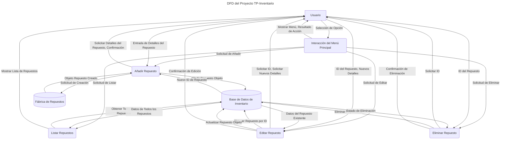

# DFD: Visión General del Flujo de Datos del Proyecto TP-Inventario

Este Diagrama de Flujo de Datos (DFD) de Nivel 0 representa la interacción principal y el flujo de información dentro de la aplicación de gestión de inventario de repuestos.

## Leyenda
*   **A:** Entidad Externa (Usuario)
*   **P1, P2, P3, P4, P5:** Procesos
*   **DS1, DS2:** Almacenes de Datos